# Solución de Gestión de Engagements en Salesforce - ES

## Autor
Kevin E. Parimango Gómez

keving.kpg@gmail.com

+51 929686486

## 1. Lo que construí

### Objetos personalizados
- **Engagement__c**: Objeto personalizado para gestionar consultorías (engagements)
  
  - Campos: Account, Primary Contact, Related Opportunity, Status, Start Date, End Date, Budget
  - Actividades habilitadas para registrar llamadas, correos y eventos
  - Se añadió una pestaña personalizada en la app de Sales

    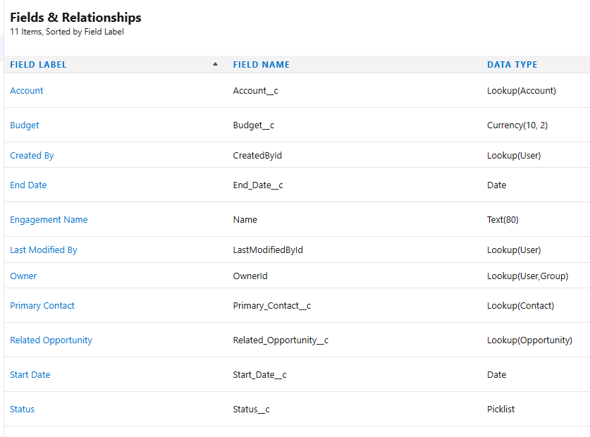

### Lightning Web Component (LWC)
- **engagementSummary**: Muestra un resumen del engagement
  - Muestra el monto de la Oportunidad Relacionada
  - Cuenta tareas completadas y eventos próximos
  - Incluye botón "Quick Follow-Up Call" para crear tareas de seguimiento
  - Ubicación: [Ir al directorio del LWC](force-app/main/default/lwc/engagementSummary/)

    

### Clases Apex
- **EngagementController**: Lógica y datos para el LWC
  - Métodos:
    - `getEngagementStats()`: Obtiene datos del engagement, monto de oportunidad y conteos de tareas/eventos
    - `createFollowUpTask()`: Crea una tarea de seguimiento
  - Ubicación: [Ir a EngagementController.cls](force-app/main/default/classes/EngagementController.cls)

### Automatización con Flow
- **Opportunity_Stage_Change_Create_Task**: Flow disparado por cambios en registros
  
  - Trigger: Cuando la etapa de la Stage cambia a "Negotiation/Review" y tiene un Engagement relacionado
  - Acción: Crear una tarea de alta prioridad asignada al dueño de la oportunidad
  - Fecha de vencimiento: Hoy + 2 días
  - Incluye fault path para manejo de errores
  
    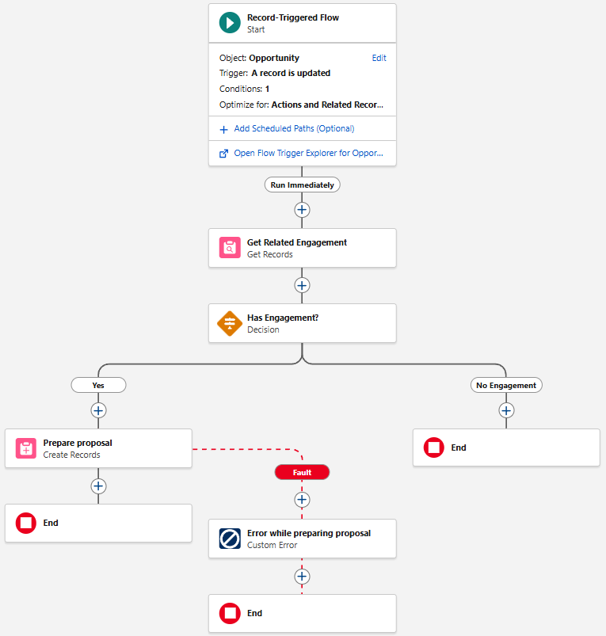

### Reportes y Tipos de Reporte
- **Custom Report Type**: "Engagements with Opportunities"
  - Primary: Engagement
  - Related: Opportunity and Account
  
- **Reporte**: "Engagement Pipeline"
  - Muestra: Engagement Name, Account, Opportunity Name, Opportunity > Amount, Opportunity > Stage, Amount, Start Date
  - Chart: Barra mostrando Suma(Monto) por Status

- **Dashboard**: "Engagement Analytics"
  - Gráfico de barra vertical y Gráfico de Donut

   [Ir a Reporte Engagement Pipeline](#4-report--chart)

### List Views
- **My Open Engagements**: Engagements donde Status ≠ Completed y Owner = usuario actual  
- **Q Engagements by Account**: Engagements agrupados con gráfico Donut (Suma de Presupuesto por Cuenta)

  [Ir a List Views](#5-list-view-chart)

### Lightning Record Page
- **Engagement Record Page**: Página personalizada
  - Incluye: Highlights Panel, Related Lists (Activities), LWC engagementSummary
  - Activada como página por defecto para el objeto Engagement

  [Ir a Lightning Record Page](#1-engagement-record-page--lwc)

## 2. Supuestos

1. **Etapa de Oportunidad**: Se usa "Negotiation/Review".
2. **Días Laborales**: Se suman 2 días calendario por simplicidad. Para días laborales reales usaría Apex. 
3. **Moneda**: USD por defecto.  

## 5. Capturas de los tests manuales

## 1. Engagement record page + LWC
  
  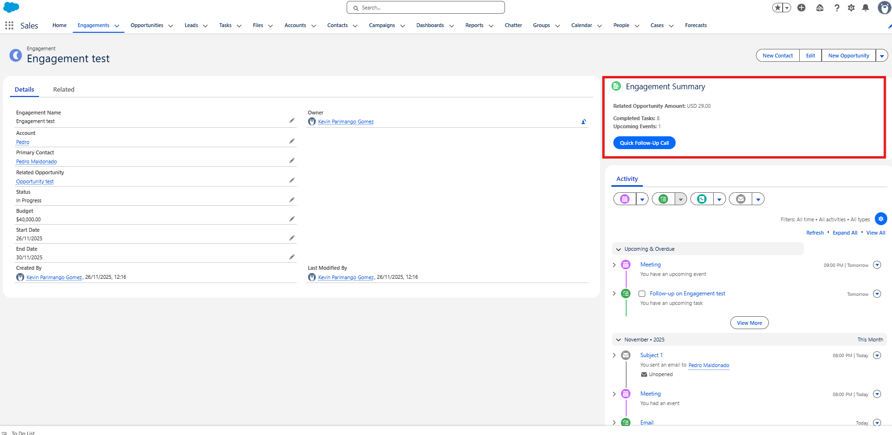

## 2. Activity Timeline (Logging a call / email / event)

  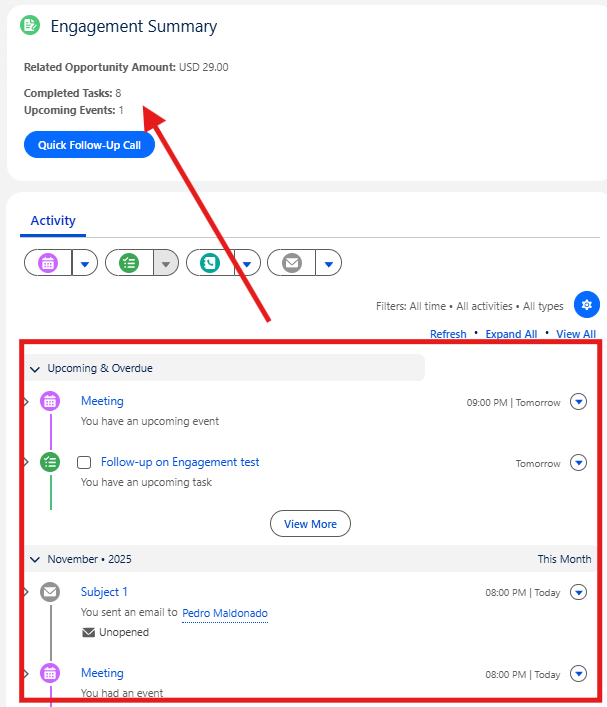

 
## 3. Flow firing

  El cambiar de cualquier Stage a “Negotation/Review” disparará un evento
	que pondrá en ejecución el Flow para la creación de una Task agendada
	para dentro de 2 días.

  ### Debug del flujo:
  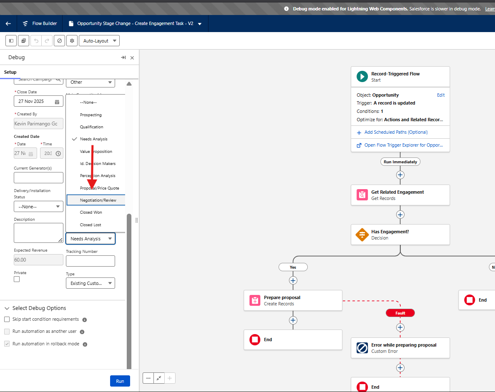

  ### Ejecución exitosa (debug):
  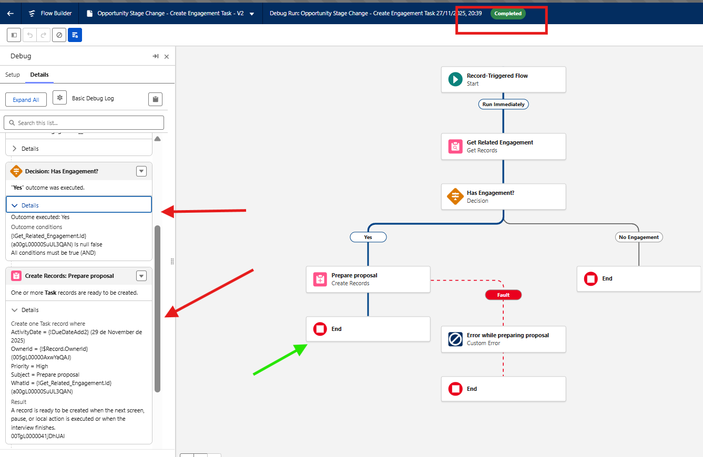

  ### Prueba real:

  #### Cambio de Stage “Need Analysis” -> “Negotiation/Review”
  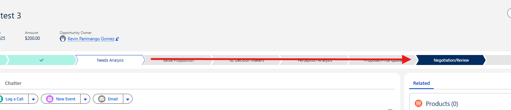

  #### Creación de Task exitosa (Dia actual 27/11; Agendado para 29/11):
  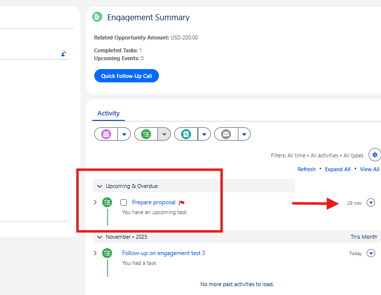

## 4. Report + Chart
  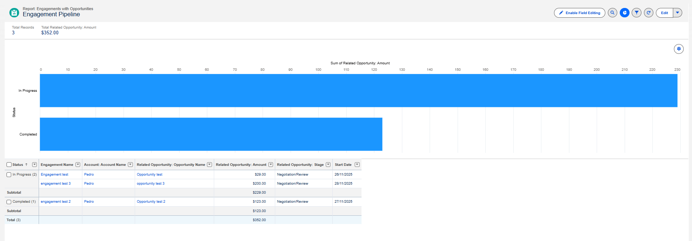

  ### Dashboard:

  

## 5. List view chart

  ### My Open Engagements 

  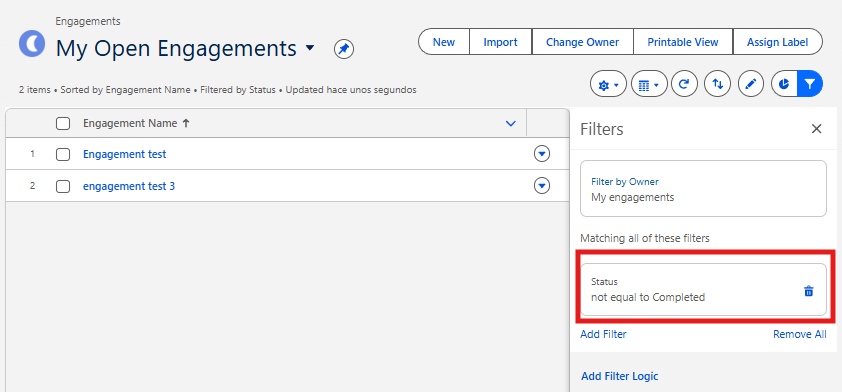

  ### Q Engagements by Account:

  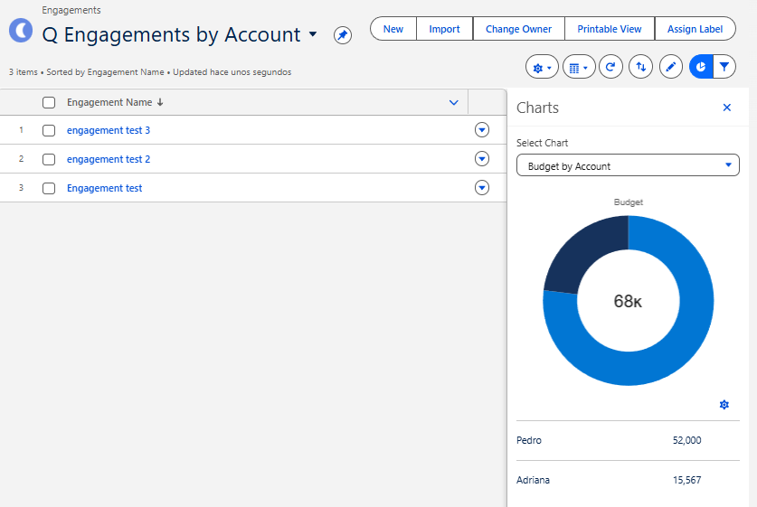
